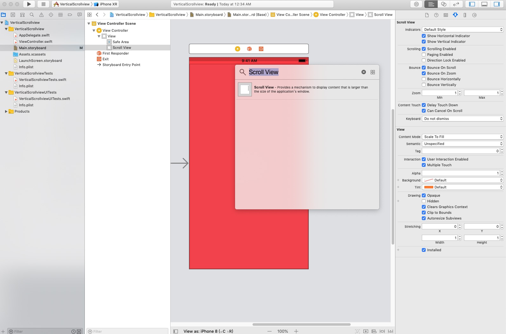
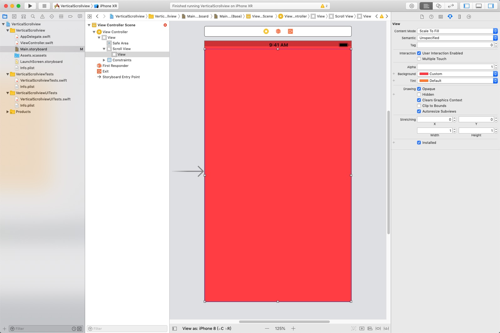
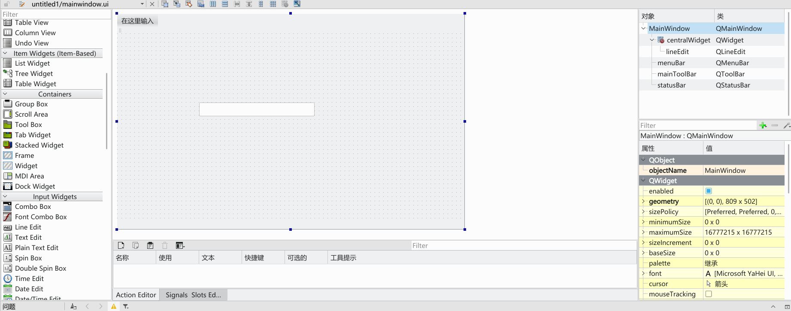
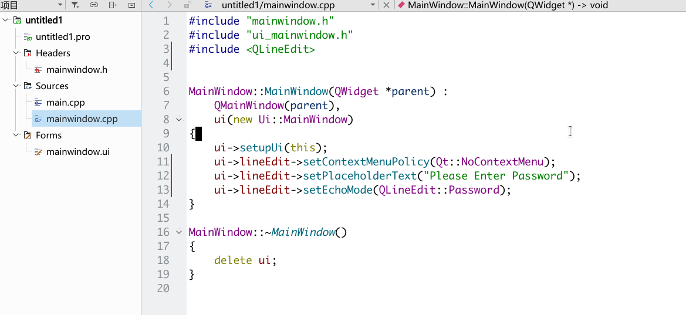
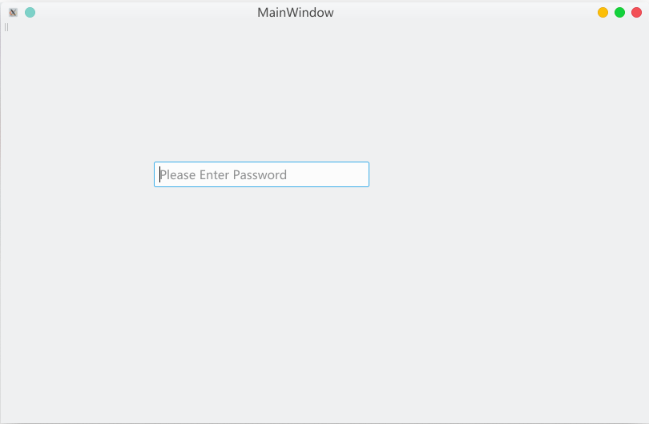

# StepOut Teamwork
## Members of Team: LinZhichao, Wang BangZheng, XieTian

## Controls
### ScrollViewer
#### Reason:
> 因为我们将要做的Project是为科研工作者服务的。因此需要一个能够支持垂直滚动的控件来做到阅读论文、笔记以及浏览自己管理的命令行参数(一个页面显示不全)等。
#### Platform:
> IOS Xcode Swift
#### examples
选用控件: UIScorollView in Swift | ScrollViewer in UWP
>由于ios storyboard的方便性。因此我们在创建ios工程后 在控件区搜索UIScorollView

拖动到UI中

添加约束

添加view控件

修改view控件的高度以及添加约束

添加两个button

运行后的效果:\


### NavigationView
#### Reason:
> 基本上所有Project是包含导航的，能够起到快速查找所需要的信息并且使程序结构贬的清晰。于是我们选择用NavigationView这个组件来进行导航，它基本满足了我们对导航需要的所有需求，能够进行界面之间的跳转并且能够做到弹放导航框。
#### Platform:
>Wechat mini-program
#### Code:
选用控件: NavigationView in Wechat mini-program | NavigationView in UWP 
```
<script>
import wepy from 'wepy';
import 'wepy-async-function';
 export default class extends wepy.app {
    config = {
        pages: ['pages/test1', 'pages/test2'],
        window: {
            backgroundTextStyle: 'light',
            navigationBarBackgroundColor: '#fff',
            navigationBarTitleText: '实验程序',
            navigationBarTextStyle: 'black'
        },
        tabBar: {
            list: [{
                pagePath: "pages/test1",
                text: "界面1",
                iconPath: "pages/icon.png",
                selectedIconPath: "pages/test1/selectedIcon.png"
            }, {
                pagePath: "pages/test2",
                text: "界面2",
                iconPath: "pages/icon.png",
                selectedIconPath: "pages/test2/selectedIcon.png"
            }],
            selectedColor: "#09bb07"
        },
        debug: true
    }

     onLaunch() {
        wx.getSystemInfo({
            success(data) {
                console.log(data)
            },
            fail() {
                console.log("fail")
            }
        })
    }
}
</script>
```
## PasswordBox

### Reason:
>  在这个注重个人隐私的时代，密码对用户而言十分重要，而且密码功能也能防止某些别有用心的人恶意篡改用户数据，因此我们需要加入密码功能，而输入密码，显然需要一个不会明文显示密码的文本框。
### Platform:
> Qt on KDE

### examples
>Qt并没有直接的密码框控件，但是可以用Line Edit来实现

三行分别设置：无上下文菜单、占位提示内容、使用模糊字符代替实际输入的字符

没有输入密码时的效果
\
输入密码时的效果

