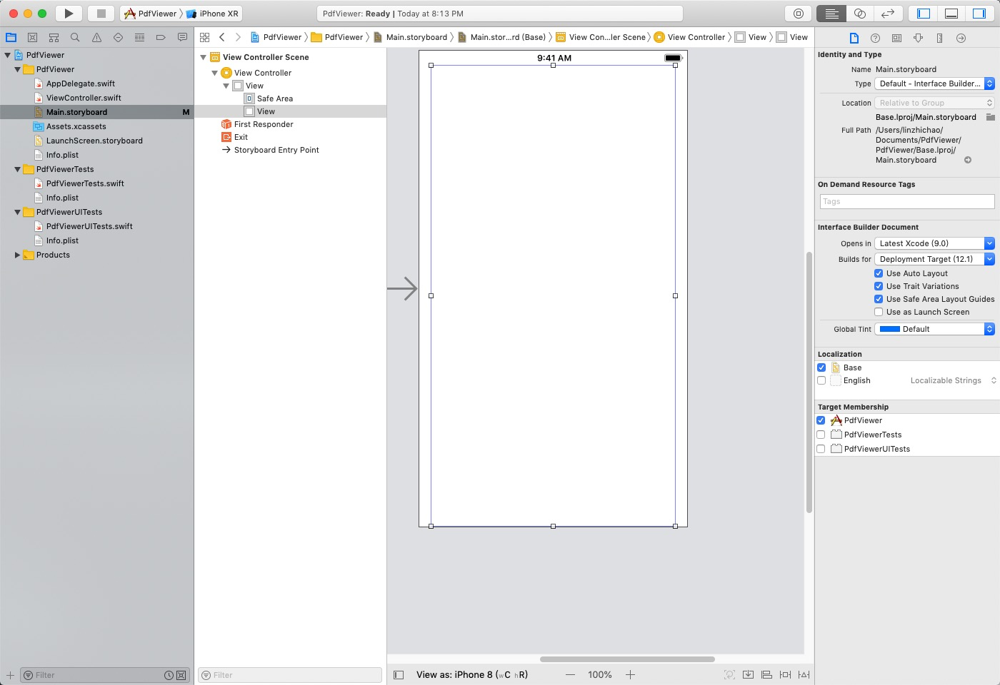
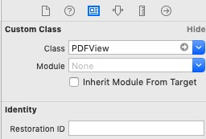
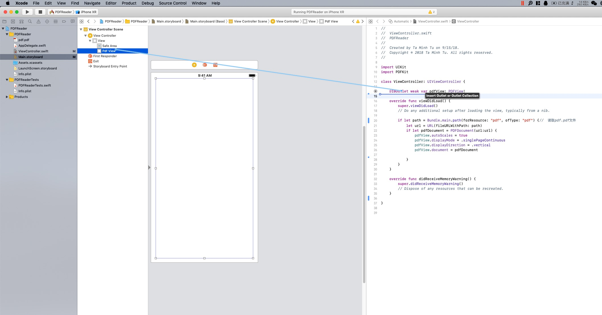
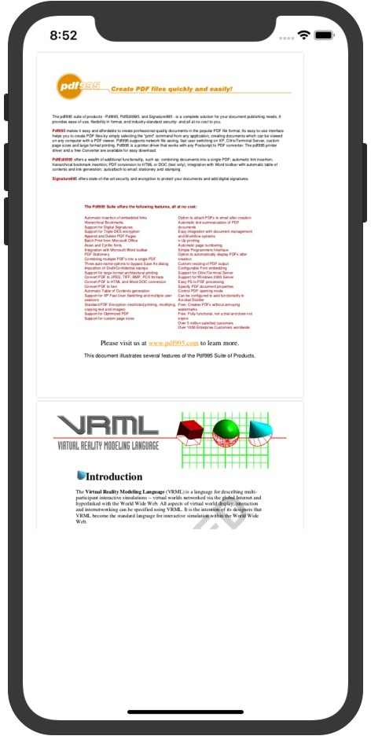

# StepOut Teamwork
## TeamName: FastResearch
## Members of Team: LinZhichao, Wang BangZheng, XieTian
## Technique:
> Open a PDF and Show It
## Reason:
> 因为我们的Project需要做到阅读论文,这就需要能通过一定的方法来展示pdf文件。因此接下来将要介绍如何在IOS开发平台上使用PDFKIT来展示pdf文件。
#### Platform:
> IOS Xcode Swift
#### Examples
##### In Uwp
在uwp中，我们要在一个UI中中显示pdf,我们需要用到在命名空间Windows.Data.Pdf的类与方法.
在官方提供的 [样例仓库](https://github.com/Microsoft/Windows-universal-samples/tree/master/Samples/PdfDocument)中提供了完整的使用办法。
下面给出官方demo中的核心代码:
```
using System;
using System.Threading.Tasks;
using Windows.Data.Pdf;
using Windows.Foundation;
using Windows.Storage;
using Windows.Storage.Pickers;
using Windows.Storage.Streams;
using Windows.UI.Xaml;
using Windows.UI.Xaml.Controls;
using Windows.UI.Xaml.Media.Imaging;

namespace SDKTemplate
{
    //demo中使用了navgation view因而需要新建一个页面叫做Scenario1_Render
    public sealed partial class Scenario1_Render : Page
    {
        private MainPage rootPage = MainPage.Current;
        private PdfDocument pdfDocument;

        const int WrongPassword = unchecked((int)0x8007052b); // HRESULT_FROM_WIN32(ERROR_WRONG_PASSWORD)
        const int GenericFail = unchecked((int)0x80004005);   // E_FAIL

        public Scenario1_Render()
        {
            this.InitializeComponent();
        }

        private async void LoadDocument()
        {
            LoadButton.IsEnabled = false;

            pdfDocument = null;
            Output.Source = null;
            PageNumberBox.Text = "1";
            RenderingPanel.Visibility = Visibility.Collapsed;

            var picker = new FileOpenPicker();
            picker.FileTypeFilter.Add(".pdf");
            StorageFile file = await picker.PickSingleFileAsync();
            if (file != null)
            {
                ProgressControl.Visibility = Visibility.Visible;
                try
                {
                    pdfDocument = await PdfDocument.LoadFromFileAsync(file, PasswordBox.Password);
                }
                catch (Exception ex)
                {
                    switch (ex.HResult)
                    {
                        case WrongPassword:
                            rootPage.NotifyUser("Document is password-protected and password is incorrect.", NotifyType.ErrorMessage);
                            break;

                        case GenericFail:
                            rootPage.NotifyUser("Document is not a valid PDF.", NotifyType.ErrorMessage);
                            break;

                        default:
                            // File I/O errors are reported as exceptions.
                            rootPage.NotifyUser(ex.Message, NotifyType.ErrorMessage);
                            break;
                    }
                }

                if (pdfDocument != null)
                {
                    RenderingPanel.Visibility = Visibility.Visible;
                    if (pdfDocument.IsPasswordProtected)
                    {
                        rootPage.NotifyUser("Document is password protected.", NotifyType.StatusMessage);
                    }
                    else
                    {
                        rootPage.NotifyUser("Document is not password protected.", NotifyType.StatusMessage);
                    }
                    PageCountText.Text = pdfDocument.PageCount.ToString();
                }
                ProgressControl.Visibility = Visibility.Collapsed;
            }
            LoadButton.IsEnabled = true;
        }

        private async void ViewPage()
        {
            rootPage.NotifyUser("", NotifyType.StatusMessage);

            uint pageNumber;
            if (!uint.TryParse(PageNumberBox.Text, out pageNumber) || (pageNumber < 1) || (pageNumber > pdfDocument.PageCount))
            {
                rootPage.NotifyUser("Invalid page number.", NotifyType.ErrorMessage);
                return;
            }

            Output.Source = null;
            ProgressControl.Visibility = Visibility.Visible;

            // Convert from 1-based page number to 0-based page index.
            uint pageIndex = pageNumber - 1;

            using (PdfPage page = pdfDocument.GetPage(pageIndex))
            {
                var stream = new InMemoryRandomAccessStream();
                switch (Options.SelectedIndex)
                {
                    // View actual size.
                    case 0:
                        await page.RenderToStreamAsync(stream);
                        break;

                    // View half size on beige background.
                    case 1:
                        var options1 = new PdfPageRenderOptions();
                        options1.BackgroundColor = Windows.UI.Colors.Beige;
                        options1.DestinationHeight = (uint)(page.Size.Height / 2);
                        options1.DestinationWidth = (uint)(page.Size.Width / 2);
                        await page.RenderToStreamAsync(stream, options1);
                        break;

                    // Crop to center.
                    case 2:
                        var options2 = new PdfPageRenderOptions();
                        var rect = page.Dimensions.TrimBox;
                        options2.SourceRect = new Rect(rect.X + rect.Width / 4, rect.Y + rect.Height / 4, rect.Width / 2, rect.Height / 2);
                        await page.RenderToStreamAsync(stream, options2);
                        break;
                }
                BitmapImage src = new BitmapImage();
                Output.Source = src;
                await src.SetSourceAsync(stream);
            }
            ProgressControl.Visibility = Visibility.Collapsed;
        }
    }
}
```

##### _In Swift_
下面给出在Swift出如何在一个content中显示pdf的样例:
1. 拖动view插件到View Controller中，设置好比例

2. 设置为 PDFView类 \

3. 创建pdfView在ViewController.swfit中,同时\
```
import PDFKit
```

4. 接着在ViewController.swfit输入以下代码(配有注释):
```
import UIKit
import PDFKit

class ViewController: UIViewController {

    @IBOutlet weak var pdfView: PDFView!
    
    override func viewDidLoad() {
        super.viewDidLoad()
        // Do any additional setup after loading the view, typically from a nib.
        
        if let path = Bundle.main.path(forResource: "pdf", ofType: "pdf") {//  读取pdf.pdf文件
            // 获取要打开文件的url
            let url = URL(fileURLWithPath: path)
            //读取该url对应的pdf文件并且设置属性
            if let pdfDocument = PDFDocument(url:url) {
                // 自动调整距离
                pdfView.autoScales = true
                // 单面y显示
                pdfView.displayMode = .singlePageContinuous
                // 设置显示方向
                pdfView.displayDirection = .vertical
                //  显示pdfDocument打开的pdf文件
                pdfView.document = pdfDocument
                
            }
        }
    }

    override func didReceiveMemoryWarning() {
        super.didReceiveMemoryWarning()
        // Dispose of any resources that can be recreated.
    }

}
 ```
5. 运行后显示效果为: \



